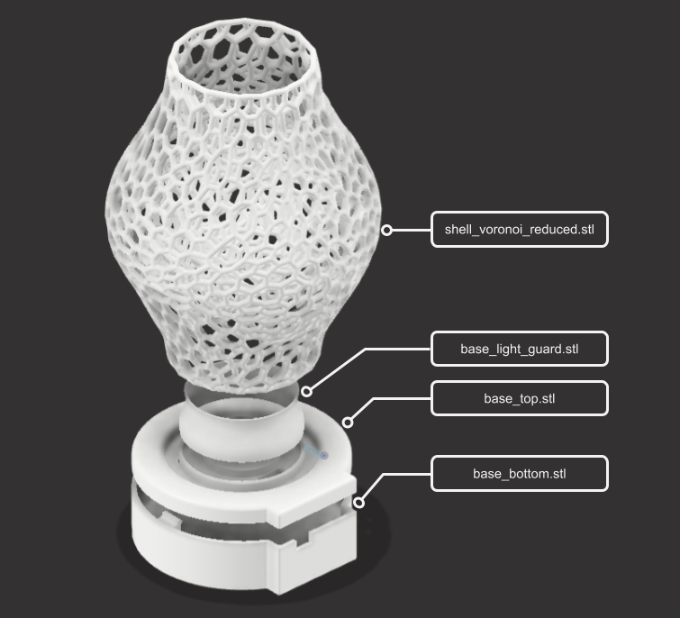
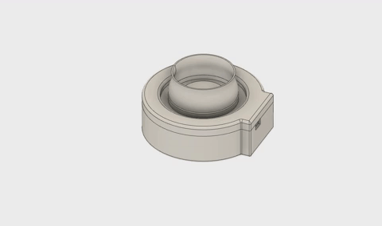

# Voronoi Lamp

This is a simple lamp with a voronoi pattern, which when lighted by a ring of 12 WS2812B LEDs results in a nice little light show! Any amount of customization of the light effects is possible using the [FastLED](https://github.com/FastLED/FastLED) library.

 

## 3D Design

Here is a breakdown of the 4 main components of the 3D printed design. All the STL files can be found in this repository.
- shell_voronoi_reduced.stl: The top part of the lamp with the vornoi pattern. This was created by first making a vase-like shape, which was then edited using meshmixer to create the final shape. I followed the steps shown in [this video](https://www.youtube.com/watch?v=kh5jKgsEQak&t=3s).
- base_light_guard.stl: This blocks the LEDs from being directly visible. Unfortunately this part was an afterthought (only when I realized that the LEDs need to be guarded from view after I assembled everything else), and so I used a bit of hot glue for assembly.
- base_top.stl: Top part of the base with 2 circular grooves. The outer groove is for the voronoi shell, and the inner groove is for the LED ring (see electronic parts below).
- base_bottom.stl: Bottom part of the base with cutouts for the USB connector and snap fit thingies. I am a beginner in Fusion 360 and my snap fit contacts are a bit loose (again a dab of hot glue made this nice and tight).

The design file (voronoi-lamp-base.f3d) for the base is included in this repository for anyone who wants to improve it.

## Circuit

The connections are pretty straightforward, as shown below. Here are the parts needed:
- Arduino Nano + micro USB cable
- 220 ohm resistor
- 330 micro Farad capacitor
- LED ring of 12 WS2812B RGB LEDs, such as [this one](https://www.amazon.de/dp/B07TZK9DNT/ref=twister_B07ZT3GZ91?_encoding=UTF8&th=1) with an outer diameter of 5 cm. For other sizes, you will need to edit the file base_top.stl.
- Connecting wires, general purpose PCB, soldering equipment.

Again, my lack of design skills resulted in the PCB being just glued down inside the case. I would have liked to make it prettier, but maybe that's for next time.

## Code

I simply used one of the examples from the [FastLED examples](https://github.com/FastLED/FastLED/tree/master/examples) and changed the number of LEDs and the data pin. See the file [fastled_pride.ino](fastled_pride.ino).
